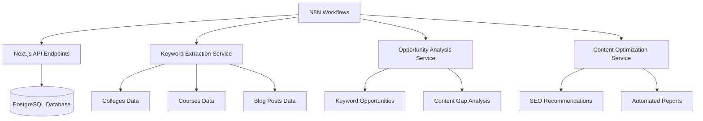
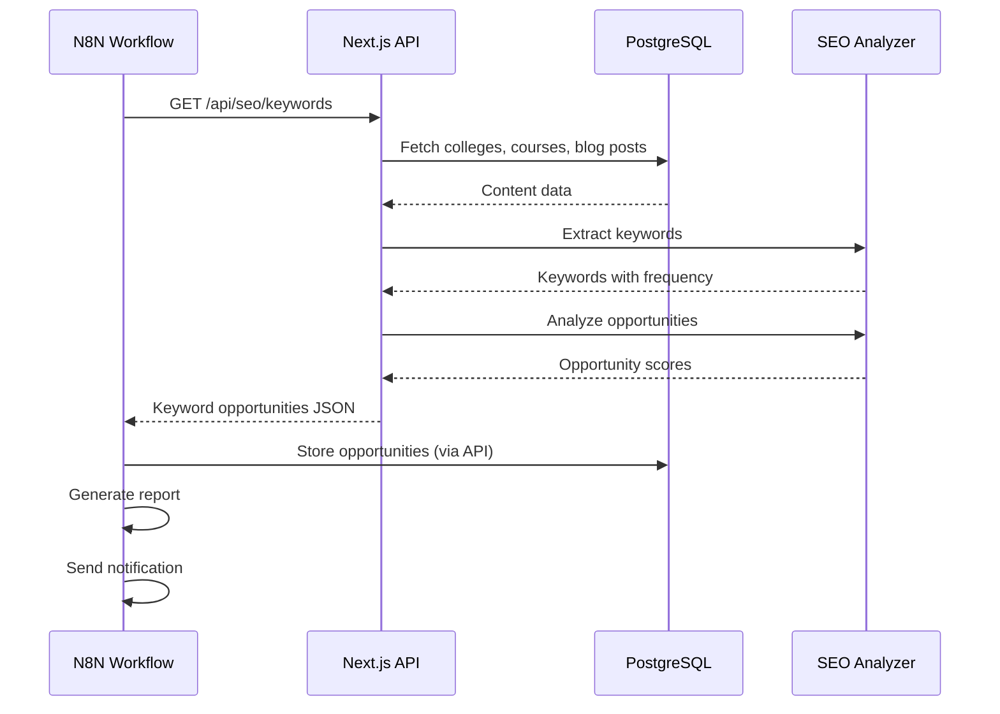

# N8N SEO Auto

mation Workflows for Rank #1

## Overview

Create comprehensive N8N workflows that automate SEO tasks to improve Google rankings, with focus on keyword tracking and opportunity identification from your database content (colleges, courses, blog posts).

## Architecture




## Implementation Plan

### Phase 1: API Endpoints for N8N Integration

#### 1.1 Create SEO Data API Endpoints

**File: `src/app/api/seo/keywords/route.ts`**

- GET endpoint to extract keywords from all content
- Accepts filters: `type` (colleges, courses, blog), `limit`, `minFrequency`
- Returns: keywords with frequency, content type, associated entities

**File: `src/app/api/seo/opportunities/route.ts`**

- POST endpoint to analyze keyword opportunities
- Input: target keywords, competitor keywords, search volume data
- Returns: opportunity score, difficulty, potential traffic, content suggestions

**File: `src/app/api/seo/analysis/route.ts`**

- GET endpoint for content SEO analysis
- Analyzes: keyword density, internal linking, meta tags, content length
- Returns: SEO score, recommendations, missing elements

**File: `src/app/api/seo/reports/route.ts`**

- GET endpoint to generate SEO reports
- Returns: keyword rankings, content performance, optimization opportunities
- Supports date ranges and filtering

#### 1.2 Create Keyword Extraction Service

**File: `src/lib/seo/keywordExtractor.ts`**

- Extract keywords from colleges (name, description, location, courses)
- Extract keywords from courses (name, description, level, duration)
- Extract keywords from blog posts (title, content, tags)
- Calculate keyword frequency and relevance
- Identify long-tail keywords
- Group related keywords

#### 1.3 Create Opportunity Analysis Service

**File: `src/lib/seo/opportunityAnalyzer.ts`**

- Analyze keyword search volume potential
- Identify content gaps (keywords not covered)
- Calculate keyword difficulty
- Suggest content types (blog post, location page, course page)
- Prioritize opportunities by potential impact
- Compare with competitor keywords

### Phase 2: N8N Workflow Templates

#### 2.1 Keyword Tracking Workflow

**Workflow: "SEO - Keyword Tracking & Monitoring"**

- Trigger: Scheduled (daily/weekly)
- Steps:

1. Fetch all content from database (colleges, courses, blog posts)
2. Extract keywords using keyword extraction API
3. Analyze keyword opportunities
4. Compare with previous keyword data (store in database)
5. Identify new keyword opportunities
6. Generate keyword opportunity report
7. Send email/Slack notification with top opportunities

#### 2.2 Content Gap Analysis Workflow

**Workflow: "SEO - Content Gap Analysis"**

- Trigger: Scheduled (weekly)
- Steps:

1. Fetch target keywords list
2. Check which keywords are covered in existing content
3. Identify uncovered keywords (content gaps)
4. Prioritize gaps by search volume and difficulty
5. Suggest content types for each gap
6. Generate content briefs for missing content
7. Create tasks/notifications for content creation

#### 2.3 SEO Performance Monitoring Workflow

**Workflow: "SEO - Performance Monitoring"**

- Trigger: Scheduled (daily)
- Steps:

1. Fetch content performance data
2. Analyze keyword rankings (if Google Search Console API integrated)
3. Track content engagement metrics
4. Identify underperforming content
5. Generate optimization suggestions
6. Create optimization tasks

#### 2.4 Automated Content Optimization Workflow

**Workflow: "SEO - Content Optimization Suggestions"**

- Trigger: On content update or scheduled
- Steps:

1. Analyze content SEO score
2. Check keyword optimization
3. Verify internal linking
4. Check meta tags
5. Generate optimization recommendations
6. Create actionable tasks

### Phase 3: Database Schema for SEO Tracking

#### 3.1 Create SEO Tracking Tables

**File: `src/db/schema.ts` - Add new tables:**

```typescript
// Keyword tracking table
export const seoKeywords = pgTable("seo_keywords", {
  id: serial("id").primaryKey(),
  keyword: varchar("keyword", { length: 255 }).notNull().unique(),
  searchVolume: integer("search_volume"), // Estimated monthly searches
  difficulty: integer("difficulty"), // 1-100 difficulty score
  currentRanking: integer("current_ranking"), // Current position in search
  targetRanking: integer("target_ranking"), // Target position
  contentType: varchar("content_type", { length: 50 }), // college, course, blog, location
  contentId: integer("content_id"), // ID of associated content
  opportunityScore: integer("opportunity_score"), // Calculated opportunity score
  lastAnalyzed: timestamp("last_analyzed"),
  createdAt: timestamp("created_at").defaultNow().notNull(),
  updatedAt: timestamp("updated_at").defaultNow().notNull(),
});

// SEO opportunities table
export const seoOpportunities = pgTable("seo_opportunities", {
  id: serial("id").primaryKey(),
  keyword: varchar("keyword", { length: 255 }).notNull(),
  opportunityType: varchar("opportunity_type", { length: 50 }), // content_gap, optimization, new_content
  suggestedContentType: varchar("suggested_content_type", { length: 50 }),
  priority: integer("priority"), // 1-10 priority score
  estimatedTraffic: integer("estimated_traffic"),
  difficulty: integer("difficulty"),
  recommendation: text("recommendation"),
  status: varchar("status", { length: 50 }).default("pending"), // pending, in_progress, completed
  assignedTo: integer("assigned_to").references(() => users.id),
  createdAt: timestamp("created_at").defaultNow().notNull(),
  updatedAt: timestamp("updated_at").defaultNow().notNull(),
});

// SEO performance tracking
export const seoPerformance = pgTable("seo_performance", {
  id: serial("id").primaryKey(),
  contentType: varchar("content_type", { length: 50 }).notNull(),
  contentId: integer("content_id").notNull(),
  keyword: varchar("keyword", { length: 255 }).notNull(),
  ranking: integer("ranking"),
  impressions: integer("impressions"),
  clicks: integer("clicks"),
  ctr: decimal("ctr", { precision: 5, scale: 2 }), // Click-through rate
  date: date("date").notNull(),
  createdAt: timestamp("created_at").defaultNow().notNull(),
});
```


### Phase 4: N8N Workflow Implementation Files

#### 4.1 Create N8N Workflow JSON Templates

**File: `n8n-workflows/keyword-tracking.json`**

- Complete N8N workflow JSON for keyword tracking
- Includes HTTP requests, data processing, notifications

**File: `n8n-workflows/content-gap-analysis.json`**

- Workflow for identifying content gaps
- Generates content suggestions

**File: `n8n-workflows/seo-monitoring.json`**

- Workflow for monitoring SEO performance
- Alerts and reporting

**File: `n8n-workflows/content-optimization.json`**

- Workflow for content optimization suggestions
- Automated recommendations

#### 4.2 Create N8N Setup Documentation

**File: `N8N_SEO_SETUP.md`**

- Step-by-step N8N setup guide
- API endpoint configuration
- Workflow import instructions
- Environment variables setup
- Scheduling configuration

### Phase 5: Keyword Opportunity Identification Logic

#### 5.1 Implement Opportunity Scoring Algorithm

**File: `src/lib/seo/opportunityAnalyzer.ts`**

- Calculate opportunity score based on:
- Search volume (higher = better)
- Keyword difficulty (lower = better)
- Content gap (not covered = opportunity)
- Competition analysis
- Current ranking (if tracked)
- Prioritize opportunities by potential impact

#### 5.2 Content Gap Detection

**File: `src/lib/seo/contentGapAnalyzer.ts`**

- Compare target keywords with existing content
- Identify missing keywords
- Suggest content types for gaps
- Generate content briefs

### Phase 6: Integration Points

#### 6.1 N8N Webhook Endpoints

**File: `src/app/api/n8n/webhook/route.ts`**

- Webhook endpoint for N8N to trigger actions
- Secure with API key authentication
- Support for different webhook types

#### 6.2 N8N Credentials Configuration

- Document required API credentials
- Environment variables for N8N
- Database connection for N8N (if needed)

## Workflow Details

### Workflow 1: Daily Keyword Tracking

**Schedule**: Daily at 9 AM**Purpose**: Track keyword performance and identify new opportunities**Steps**:

1. HTTP Request → GET `/api/seo/keywords?type=all&limit=1000`
2. Process Keywords → Extract and analyze
3. Compare with Previous Data → Identify changes
4. Calculate Opportunities → Score new opportunities
5. Store Results → Save to `seo_keywords` table
6. Generate Report → Create opportunity report
7. Send Notification → Email/Slack with top 10 opportunities

### Workflow 2: Weekly Content Gap Analysis

**Schedule**: Weekly on Monday**Purpose**: Identify content gaps and suggest new content**Steps**:

1. Fetch Target Keywords → From database or external source
2. Check Coverage → Compare with existing content
3. Identify Gaps → Find uncovered keywords
4. Prioritize Gaps → Score by opportunity
5. Generate Suggestions → Content type and brief
6. Store Opportunities → Save to `seo_opportunities` table
7. Create Tasks → Generate actionable tasks

### Workflow 3: Content SEO Analysis

**Schedule**: On-demand or scheduled**Purpose**: Analyze content SEO and suggest optimizations**Steps**:

1. Fetch Content → Get colleges, courses, or blog posts
2. Analyze SEO → Check keywords, meta tags, structure
3. Generate Recommendations → Optimization suggestions
4. Store Analysis → Save SEO scores
5. Create Optimization Tasks → Actionable items

## Data Flow




## Files to Create/Modify

### New Files:

- `src/app/api/seo/keywords/route.ts` - Keyword extraction API
- `src/app/api/seo/opportunities/route.ts` - Opportunity analysis API
- `src/app/api/seo/analysis/route.ts` - Content SEO analysis API
- `src/app/api/seo/reports/route.ts` - SEO reports API
- `src/app/api/n8n/webhook/route.ts` - N8N webhook endpoint
- `src/lib/seo/keywordExtractor.ts` - Keyword extraction logic
- `src/lib/seo/opportunityAnalyzer.ts` - Opportunity analysis logic
- `src/lib/seo/contentGapAnalyzer.ts` - Content gap detection
- `n8n-workflows/keyword-tracking.json` - N8N workflow template
- `n8n-workflows/content-gap-analysis.json` - N8N workflow template
- `n8n-workflows/seo-monitoring.json` - N8N workflow template
- `n8n-workflows/content-optimization.json` - N8N workflow template
- `N8N_SEO_SETUP.md` - Setup and configuration guide

### Modified Files:

- `src/db/schema.ts` - Add SEO tracking tables
- `package.json` - Add any required dependencies

## Environment Variables

Add to `.env`:

```javascript
N8N_API_KEY=your-n8n-api-key
N8N_WEBHOOK_URL=https://your-n8n-instance.com/webhook
SEO_ANALYSIS_ENABLED=true
```


## Success Metrics

- Number of keyword opportunities identified
- Content gaps discovered
- SEO optimization suggestions generated
- Automated reports created
- Time saved on manual SEO tasks

## Next Steps After Implementation

1. Import workflows into N8N
2. Configure API endpoints and credentials
3. Set up scheduling for automated workflows
4. Test workflows with sample data
5. Monitor workflow execution